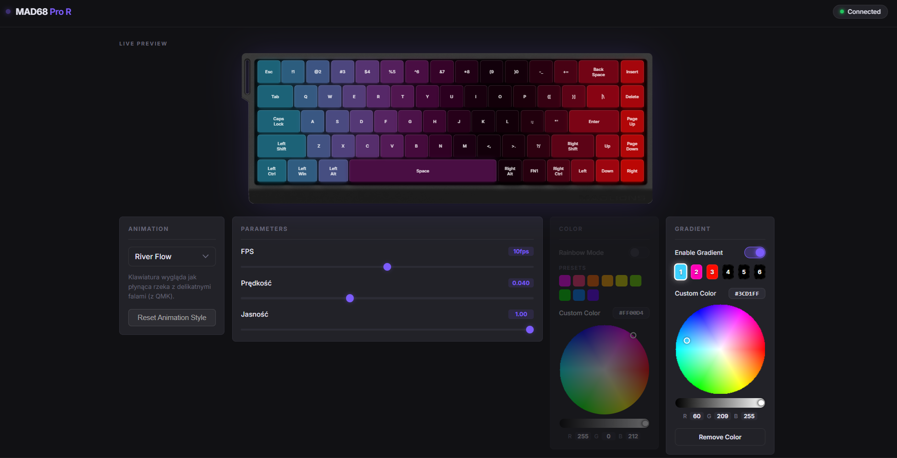

# MADLIONS MAD 68 Pro RGB Control

[Kliknij tutaj, aby przejść do wersji polskiej (README_PL.md)](README_PL.md)

This project provides a custom web-based interface and a Python-powered engine for controlling the RGB lighting on the **MADLIONS MAD 68 Pro** keyboard (and potentially other compatible 68-key models). It bypasses the standard software to give you full control over animations via a sleek dark-mode web panel.



⚠️ **Safety Notice**: This program does **NOT** modify the keyboard's internal firmware in any way. It uses the built-in "Customization" lighting mode to simply send raw color commands to specific keys. The software cannot physically damage your keyboard (the chance is literally 0%), as long as you use reasonable animation parameters. 
*Tip: We recommend setting the panel's "FPS" to **8-10** and avoiding excessively high animation speeds for the most stable and smooth experience.*

## 🚀 Features
- **Real-time Control**: Change animations, colors, and parameters instantly via WebSockets.
- **Gradient Support**: Define custom color sequences (up to 6 slots) for many animations.
- **Animation Engine**: Modular architecture where animations are defined as simple JSON files with embedded Python logic.
- **Web UI**: Modern, glassmorphism-inspired dashboard.

---

## 🛠️ Requirements
- **Node.js**: Version 22+ (tested on v22.20.0)
- **Python**: Version 3.13+ (tested on 3.13.13)
- **Keyboard**: MADLIONS MAD 68 Pro (or models with the same matrix layout)

---

## 📦 Installation

1. **Clone/Download** this repository to your computer.
2. **Install Node.js dependencies**:
   Open a terminal in the project folder and run:
   ```bash
   npm install
   ```
3. **Install Python dependencies**:
   You need the `hidapi` library to communicate with the hardware:
   ```bash
   pip install hidapi
   ```

---

## 🚦 How to Run

1. Connect your keyboard via USB.
2. Double-click `start.bat` in the main folder.
3. Open your browser and go to: `http://localhost:3333`

---

## ⚙️ Configuration (VID/PID)

If your keyboard is not detected, it might have a different hardware revision and you will need to update the **Vendor ID (VID)** and **Product ID (PID)**.

### [Option A - Recommended] Use the detection script
In Windows, a single keyboard can spawn dozens of virtual HID devices, making it hard to find the right one manually. We provided a script to help:
1. Go to the `engine/` folder.
2. Run `find_my_keyboard.py` (double-click it).
3. A terminal will pop up listing all connected MADLIONS keyboards.
4. Note down the `0x...` values for VID and PID.

### [Option B - Alternative] Windows Device Manager
1. Open **Device Manager**.
2. Find your keyboard under "Human Interface Devices".
3. Right-click -> **Properties** -> **Details** tab.
4. Select **Hardware IDs** from the dropdown. You will see something like `VID_373B&PID_10D4`.

### How to update the project:
1. Open `engine/rgb_engine.py` (e.g., in Notepad).
2. Find the line: `class HIDController:`
3. Update the default values:
   ```python
   def __init__(self, vid=0x373B, pid=0x10D4, interface=1):
   ```
   *(Replace `0x373B` and `0x10D4` with the values you found)*

---

## 🎨 Adding Your Own Animations

Animations are located in the `animations/` folder. To add a new one, create a `.json` file.

### Structure of an animation JSON:
- `id`: Internal unique ID.
- `name`: Name displayed in the UI.
- `supports_gradient`: `true` if you want to use the Gradient tab.
- `params`: Definitions of sliders/toggles for the UI.
- `code`: The actual Python logic.

### Logic (Python):
The `code` section is executed every frame. You have access to:
- `matrix`: A bytearray representing the RGB state (3 bytes per key).
- `t`: Current time (seconds).
- `params`: A dictionary containing values from the UI sliders.
- `colorsys`: Library for HSV to RGB conversions.
- `math`: Standard math functions.

---

## 🛡️ License
This project is licensed under the **GNU General Public License v3.0**. This means it is free to use, modify, and distribute, but any derivative works must also remain open-source under the same license. Commercial sale of this software is prohibited.
